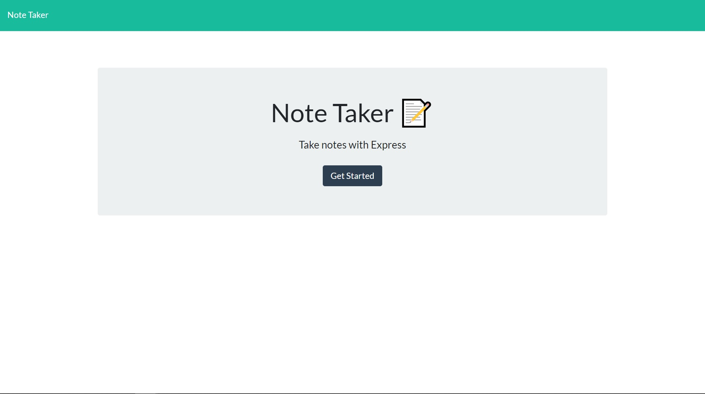
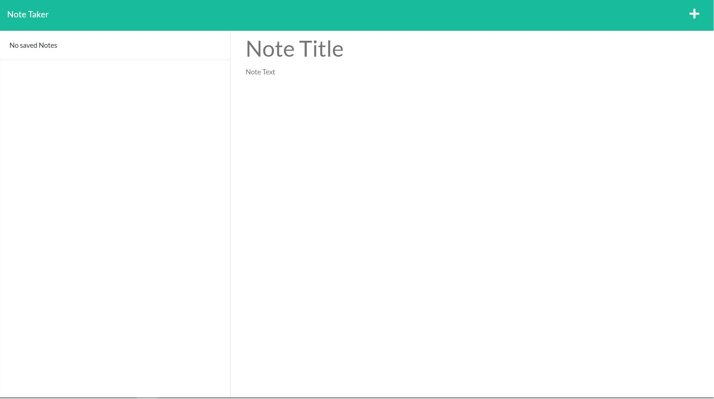

# Note-taker

## Table Of Contents
  - [Description](#description)
  - [Installation](#installation)
  - [Usage](#usage)
  - [Questions](#questions)

## Description
This app allows the user to create, save and discard notes.




The app has been created with HTML, CSS, JS and Express.js

## Installation
Package required: </br>
- Express
- fs 
</br>
Please run the following command:
```bash
npm i
```

## Usage
To run the app enter the following command on the terminal:
```bash
node index.js
```
Link to the deployed app: https://note-taker-week11-cg.herokuapp.com/notes

## Questions
If you have any questions you can find me in: </br>
GitHub: https://github.com/GrilloGG </br>
Email: grillo.garnacho@gmail.com
